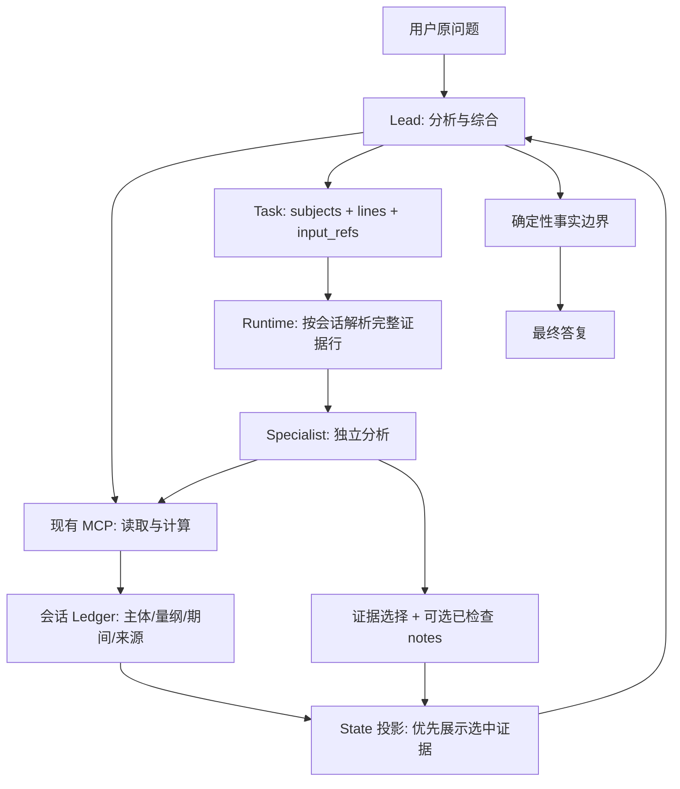

# S3: 任务与证据绑定的多资源架构实施计划

日期：2026-09-29。实施基线：`codex/simplify-agent-loop-s2` / `6a03fe5`。
依据：S2_mini 的 Q03/Q16/Q19、X01/X07 原始 trace 与离线重放；远端 f26c7f9 相比本地只增加测试记录/文档，不改变产品路径。

## 架构决策

主 agent 持有用户原问题、分析选择和最终综合责任。确定性资源读取/计算可直接执行；独立探索和分析才委托 specialist。沿用现有 MCP 工具、权限收窄、会话 ledger 和 PostgreSQL analysis_state，不增加协调服务或 reviewer。

本决策替代 SIMPLIFICATION_PLAN.md 中“lead 只能 ask/open”的边界。保留原计划关于事实真实性、租户/会话隔离、状态版本、部分成果保存及离线语义评测的要求。Skill/handbook 是按需读取的方法说明，不作为新事实或权限来源。

## 本次实施及验收

1. **绑定输入。** ask 增加可选 input_refs（最多 16 个现有事实 ID）；先按会话 ledger 验证，再在 specialist 首次 prompt 独立证据块中交付真实行。任务文字不能替代证据。跟踪 input_refs 到任务记录。未知 ID 在派单前拒绝。验收跨 domain 的 NVDA drawdown 随 risk 任务进入实际 prompt，且伪造/跨会话 ID 不通过。
2. **允许 lead 直接取数/计算。** 使用现有 meta MCP mount 的收窄 token，只开放 list、filings_read、prices_read、book_read、metric、calc。沿用 tool trace、ledger、事实边界，记录实际调用次数；禁止通过直接路径扩大到 start/scenario/web_search。handbook 通过 open 按需加载。验收 lead 的 calc/read 无需新增 subagent，工具错误仍可恢复，权限仍由服务端 deny 执行。
3. **可达的结果。** STATE 全局优先展示已检查 notes/选中 evidence，再展示未选中 rows；分页保持完整卡片和不可变快照。rep_ 句柄可打开所属会话的报告日志，不把历史报告文字重新当作可信事实。验收较旧任务的选中结果不被新任务大量未选中行淹没；report ID 可读且会话隔离。
4. **提交恢复。** 每次 submit 的拒绝属于该次候选；拒绝的 note 不构成未来必须满足的身份义务。已接受 evidence/notes 持续保存，显式 id 仍可修改/撤回。验收 X01 风格“修正文案但未重用旧 id”可以结束；错误候选及替换失败不能进入结果。
5. **可机械证明的含义检查。** drawdown 与 monetary operand 的主体必须对应；阻止 NVDA position × portfolio drawdown 被当作该股票历史损失。修复 passage 的完整数字和单位匹配，阻止 16% 从 $16.5 billion 获得支持；保留测量名称的限定，增加 beta benchmark 的显式不匹配检查。覆盖正确输入、合法跨主体算术及错误反例，不用运行时 LLM 判定。
6. **回归与说明。** 新增基于原失败的协议、prompt、计算及事实校验测试；运行相关测试和离线全套；更新 wording sheet、架构文档和实施结果。保留原始 baseline 重放输出。不能用离线通过冒充 29 个真实 LLM turns 的交付率提升。

## 后续能力阶段（本次不声称已实现）

Q03 的表头/期间绑定需要从结构化 filing table 生成带行列坐标、期间和单位的 quantity，不用放宽正文正则来假装修复。批量时间序列/期间别名、scenario 的 all-proceeds 以及完整语义交付评测继续按原 S3/S4 能力阶段推进；它们与这次跨资源证据传递架构分别验收。

后续 live 验收固定 fixture、模型、问题、预算和并行设置，重跑全部 main 20 turns 与 X 9 turns，独立核对主体、期间、数字和遗漏。重点 X07 应得到约 $88,280.38 和 book 的 0.8215%，而非原先 $52,217.96 / 4.06%；任务 returned 仅代表执行返回。

## 参考设计

- [Anthropic: multi-agent research system](https://www.anthropic.com/engineering/multi-agent-research-system)：委托边界与上下文交付。
- [Anthropic: context engineering](https://www.anthropic.com/engineering/effective-context-engineering-for-ai-agents)：上下文选择和按需加载。
- [Agent Skills specification](https://agentskills.io/specification)：方法说明的渐进加载。

