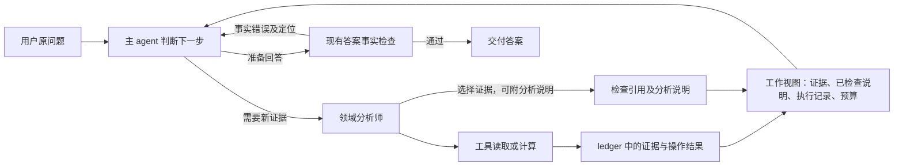

# Agent loop 简化：实现提案

2026-09-29。核对代码：`origin/desk-v2-wip@e5d4b45003c593ea42730110a837a010c2a7f725`。实例依据：V2E2_mini，受测代码 `68a52e1`。本文保留实施前的设计；用户已批准开始修改，第一批 S1、第二批 S2 的实际范围与验证分别见 [SIMPLIFICATION_S1.md](SIMPLIFICATION_S1.md) 和 [SIMPLIFICATION_S2.md](SIMPLIFICATION_S2.md)。S3 能力补齐与 S4 实例验收尚未完成。

**目标：减少模型维护协议、转写证据、解释程序状态的负担，让主 agent 可以迭代分析，同时保留事实来源、计算与执行边界。** 验收对象仍是用户原问题；模型自己声明的要求数、runtime 的 completed、出答案率都不能代替验收。

本提案有意调整 V2 的两个决定：强制 requirements/for 映射，以及每个任务行必须“settled 或 boundary”的交接。它属于设计变更，不应混进一个声称完全不改契约的 bugfix。

**一、保留的架构与约束**

- 保留一个主 agent、issuer/market/risk 三个有界分析师，以及现有工具面隔离。主 agent 继续通过 ask/open 协作，不接管所有底层工具 schema。
- 保留 PostgreSQL 的 ledger、analysis_state、analyst_reports 和执行 trace，保留现有 scope、证据指纹、版本检查与跨会话访问限制。
- 保留确定性事实校验；模型写入的说明、结论、caveat、后续建议和可复用状态文字共用事实边界。未经检查的内容不借“计划”“假设”名义进入已确认知识。
- 语义 reviewer 只离线评测，不参与运行时放行、阻断、修复路由、状态更新或 context 回填。
- 不增加 Redis、控制 agent、通用工作流引擎、claims DSL；不改 lease、续期、心跳或当前并行配置。
- 不靠关闭数值检查、解除 forecast/withheld 政策、提高模型自报完成率来获得测试通过。

**二、目标 loop**



程序记录“做了什么、拿到了什么、什么检查未通过”；主 agent 决定“这些是否足够、下一步做什么”。不新增一轮隐藏的 reviewer 调用。主 agent 在原 loop 内对照用户原问题思考即可。

程序不能从一个已接受引用推出“用户要求已满足”。同样，工具失败只证明一次操作没有成功，不能自动推出业务问题无解。

**三、删减清单**

| 当前协议 | 简化后的行为 | 主要代码 |
|---|---|---|
| 第一次 ask 必须声明 requirements，anchor 逐字复制 | ask 只表达需要分析师做的工作；用户原问题持续在 context 中 | delegation.ASK_TOOL、parse_requirements、meta_agent |
| tasks.for 同时支持整任务与逐行映射 | 从新模型接口移除 for；不再让模型维护 requirement—line 图 | delegation.Task、parse_tasks |
| 每个任务行必须提交 settled 或 why+boundary | 返回选中的证据和可选分析说明，允许部分交回，不强迫补齐解释 | SUBMIT_TOOL、handoff_check、sub_analyst |
| 没做完必须寻找 absence/policy 来解释 | runtime 附实际失败、预算或暂停记录；不要求模型制造业务边界 | sub_analyst、analysis_state |
| 问题完整性由 requirement 状态、引用关联计算 | runtime 停止签发语义上的 completed；仅报告交付与执行结果 | unaddressed、completion_of、meta_agent |
| follow-up 按 requirement 整批 supersede | follow_up_of 只表示继续和复用；不自动撤销之前通过的发现 | start_tasks、merge_task |
| ask 回单与 STATE 都携带整份 finding 和行 | 回单发收据，工作视图提供当前结果正文，open 按需读取细节 | for_lead、analysis_state.view、delivery |
| findings 的 refs 与正文括号重复填写 | 逐步接受 block 级 refs，由同一事实检查解释；不增加另一套事实规则 | fact_boundary、answer_check |

原字段和历史记录先保留可读，不在第一批删除数据库列。旧 requirements 不再作为新协议的调度或完整性判定依据。

**四、ask：保留自然语言委派，移除必须一次拆对的问题模型**

第一批保留现有 `tasks`、`analyst`、`subjects`、`lines`，可选 `context` 与 `follow_up_of`。无需为了简化再把 lines 改名为 question。例：

```json
{
  "tasks": [{
    "analyst": "issuer",
    "subjects": ["XOM"],
    "lines": ["比较最近四季的杠杆与偿债能力，结合 10-K 说明油价下跌时的压力。"]
  }]
}
```

`lines` 是工作说明，不再是必须逐项提交关闭证明的状态对象。主 agent 可以继续追问、改变比较方法、缩小或扩大下一批工作。最初的委派不是不可修改的全局计划。

任务 id、scope、输入版本、执行状态均由 runtime 注入。模型不填写这些管理字段。`follow_up_of` 只是可选复用关系，不再有“撤销此前同一 requirement 的结果”的隐式效果。

依赖问题先用自然的分步 ask：例如 X06 先取得弱动量名字，再用已返回的主体进行情景计算。无依赖工作可以同批委派；不为此新增 DAG schema。工具仍检查传入的主体/书是否合法；“合法名字是否正是用户想要的那个”不能仅靠存在性检查保证，需要主 agent 保留带来源的选择结果，并在离线测试检查传递是否正确。

第一批不新增 update_plan 工具或持久化自由文本 scratchpad。主 agent 的临时计划留在本轮工作上下文；可复用的事实性结论仍必须经过事实边界。task/context 是指令，不作为事实来源；模型委派时写下的数字不能因此被重新定义为用户已给出的事实。

**五、submit：证据可以直接交付，分析文字可选**

目标模型接口只需要两部分（以下 id 与文字为格式示意）：

```json
{
  "evidence": ["f_example0001", "f_example0002"],
  "notes": [{
    "text": "对这些证据的分析说明。",
    "refs": ["f_example0001", "f_example0002"]
  }]
}
```

`evidence` 是模型挑选给主 agent 的已有 ledger 行；`notes` 可以为空。简单读取不必重新写一篇 brief，复杂分析可以附说明。工具已经返回的数字、单位、日期、主体和 caveat 由 runtime 直接展开，分析师不用重复抄写。交回证据不意味着分析已完成。

runtime 自动附任务身份、实际调用结果、后台任务收据、预算停止原因、证据索引和分页入口。这些不是模型必填内容。调用失败直接显示哪次操作的什么参数失败；通用 policy 行不会自动关闭任何用户要求。

接受与修复按条进行：有效 evidence 和已通过 notes 保留；坏 id、未通过的 note 单独给诊断。runtime 分配 note id，后续修复可以引用它；模型不预先给每个任务行编工作流编号。新的 follow-up 不撤销旧 note，明确修订或 scope 失效才替换/排除旧内容。

预算或异常结束时，仍保留已通过 notes，并返回该任务已经取得的证据索引。没有 submit 的任务不能被假装成成功分析；主 agent 看到的是执行停止原因和可读取的原始证据，而不是未经检查的自动总结。

**结构化 refs 的实现边界**：扩展同一 `fact_boundary`，为 note 提供 `text + refs` 的块级检查入口；不得以“refs 都存在”代替检查正文。数值解析必须限制在指定 refs 内，继续检查单位、主体、期间、引用和现有比较规则。裸数字不因为旁边挂了一个 refs 数组而获得豁免。

显示格式与引用可以由程序生成；当一个数匹配多个不同主体/期间、或者 passage 没有可靠量纲时，不能猜测绑定。返回具体歧义，要求拆分说明或补明确引用；不发明新的小语言。原文、检查结果、最终渲染都留在审计中。

该块级入口与现有 inline 入口必须共享规则并做等价/反例测试。第一步可以先开放 evidence-only，数值 notes 暂沿用旧引用格式；块级适配器通过验证后再切换，不能先扩大事实豁免来兼容新 schema。

**六、state：继续维护，但缩小它声称知道的范围**

继续利用现有表，只把下列内容作为主 agent 的工作视图：

| 内容 | 写入者与信任边界 |
|---|---|
| 原问题、资源 scope 与输入版本 | 用户输入和 runtime |
| 已运行/运行中的任务及操作结果 | runtime 从实际执行记录生成 |
| 已取回的证据索引与行 | 现有 ledger；行存在不代表已回答问题 |
| 已通过检查的分析说明 | subagent 或主 agent 提交，经同一事实边界 |
| 实际失败、待执行回执、剩余预算 | runtime；不映射成“问题已关闭” |

保留 `analysis_state` 的 scope、finding、任务记录与版本更新；新记录的 requirements 可以为空，completion 不从它们计算。accepted notes 可沿用 findings 的 text/refs/source/validation 结构。

主 agent 自己综合出的结论不需要另外开一个写库工具：最终答案通过检查后，可以将经过同一边界处理的结论块登记为 source=lead 的 finding，供后续回合复用；原有 scope、指纹与重验规则继续适用。中途尚未核实的解释不能因此持久化成 accepted。

用户问题的语义完整性不是数据库事实。新协议不再输出机械计算的 `completed`/`completed_with_boundaries` 作为产品保证。已有 answer gate、是否交付、实际停止原因可继续记录；未能客观判定的完整性保持未知，不增加一套模型自报 complete 来替换它。

旧 `_PARTIAL_TEXT` 不能继续把“未引用某 finding”写成“这件事未解决”。确定性尾句只能陈述真实运行事件；分析未完成到什么程度由主 agent 在受事实边界约束的正文中解释。取消该尾句不能悄悄等价成默认全部完成。

**七、context：一个当前结果视图，按需打开细节**

主 agent 持续看到原问题、已有对话、精简 roster/读法，以及单一工作视图。每轮刷新同一视图，不再不断追加相同结果全文。handbook 继续提供分析方法与方法边界，不承担“每一项任务怎么关闭”的协议教学。

`ask` 返回 task/report id、实际执行结果、新 evidence/note id 与可打开入口。正文在下一次 completion 前进入工作视图。原 tool 消息保留有效协议结构与收据，完整历史在 trace，不强行把全部旧正文继续塞进 prompt。

视图按确定性规则优先放新返回、当前 scope 内尚未交付的内容，再放之前的相关任务结果；不另加一个 LLM 摘要器。超出容量时按完整证据块分页，带总数、已显示范围和 open 入口，不能截断半条事实或丢掉它的 caveat。实际 prompt receipt 继续由 delivery.project 记录。

这些是 context 的显示规则，不是“最新内容比旧内容更正确”的事实规则。被分页移出的证据仍可访问，不能被报告为不存在。subagent 只接收本任务、资源面、相关旧结果与原问题必要上下文，不把主 agent 的全部对话复制过去。

**八、停止、修复和预算**

从 meta_agent 移除 `requirement_unaddressed` 的运行时阻断，以及由 requirement 状态自动推导完整性。不要保留一份失去有效映射的旧 coverage 检查，再改称“建议”。主 agent 根据原问题和工作视图决定继续问、打开证据或回答。

原有答案事实检查、局部 repair_answer、硬预算和重复调用保护先保留。它们针对错误事实、无进展重复与资源耗尽，不规定分析必须按几个阶段完成。第一轮不同时重写所有 loop 退出路径。

协议简化的对照实验先固定模型、总预算、工具能力和 fixture。随后单独评估批量计算和预算调整。批量调用需要记录实际 operand/计算工作量，不能通过“一个 batch 算一次”掩盖成本；共享输入可以复用，批次仍有上限。不要根据模型自己拆出的名字数和期间数无限放大预算。

**九、工具能力作为单独工作包**

这些不是删掉控制协议就会自行解决的问题，分别实现和测量：

- 期间/窗口：统一可表达的期间类型，工具根据 balance/flow 语义解析。无歧义输入可规范化；季度还是财年不明确时，不擅自猜。合法 row/measure 通过 catalogue 返回，出错保留具体字段诊断。
- 批量算术：优先扩展现有读/算动词支持有限批量和序列对齐；保留工具的资源操作性质，不制造“回答整道题”的专用工具，也不恢复 program DSL。
- Q13 全部所得：给 scenario 一个明确的买入金额来源表达，由计算层按卖出所得、费用、精度和约束计算；保留余额校验。这是组合仿真能力，不是让模型心算 weight。
- Q19 披露表格：从可定位的表格单元格生成带主体、期间、币种、scale 与来源坐标的 quantity，再走现有 calc。优先确定性结构提取；模型可选择单元格，但模型自己填写数值不能成为来源。结构或量纲未核实时仍拒绝计算。收入份额不能直接证明收益的因果份额。

**十、实现顺序与文件范围**

| 包 | 具体修改 | 验证目的 |
|---|---|---|
| S0 固定测量口径 | 冻结 e5d4b45 基线；修正报告分母；预登记原始 20 题/65 项与 X 系列的交付要求、数值核对和允许边界 | 后续不把取消 gate 当成质量提高 |
| S1 简化主循环 | delegation 移除必填 requirements/for；meta_agent 去掉覆盖阻断、自动完成判定及误导尾句；analysis_state 保留执行/证据视图；for_lead 改收据；delivery 继续实测 receipt | 单独测固定拆解与双份 context 的代价；此阶段可暂保留旧 subagent brief |
| S2 简化交接 | delegation 新增 evidence-first submit；sub_analyst 逐条接受与保留；fact_boundary/answer_check 共用块级检查；analysis_state 合并不按 requirement 撤销；analyst_reports 兼容旧读法 | 减少有证据却交不出来的问题；事实反例不能获得放行 |
| S3 补能力 | tools/primitives、catalogue、typed_calculator、scenario_service 与披露适配器分包修改 | 分清“协议改善”和“能力新增”的收益；每个包独立核对数值 |
| S4 整体验收 | 同 fixture、同模型与预算做冻结对照；随后强模型对照；最终候选连续三轮完整测试 | 按实际交付而不是内部状态验收 |

最先落地的是 S0＋S1 的一个完整切片，不要一口气改全部模块。S1 的价值需要用外部验收验证；若只是少了 gate 而遗漏更多，不能继续以“出答案更多”宣传为改善。S2 是降低引用/brief 负担的核心。S3 必须做才能覆盖现有明确能力缺口，但应保持独立提交。

模型接口只启用一个协议版本。历史兼容放在读取适配器，记录协议版本用于区分旧 report；不让当前模型在多种 payload 写法中任选。可以利用 analyst_reports.input_version 和现有 JSON 记录保存协议标识；确有列约束需要迁移时才做小迁移。旧记录不重写为新语义。

同步检查的消费者：analyst_reports 的 accepted_lines/brief 读取、sub_analyst._prior_block、open(report/task)、API 报告响应、apps/web 的 Reports.tsx/lib/api.ts，以及 battery_counters 等统计器。尤其不能把历史 verified 或新 returned 展示成“用户问题已完成”。

模型文字改动集中在 ask/submit 描述、主/sub role、STATE/PRIOR 标签和 style guide 的引用表示。实施时生成一份完整 before/after 措辞供审阅；本文不要求提前批准尚不存在的代码或措辞。

**十一、必须保留的回归与实例验收**

| 反例/实例 | 必须证明的行为 |
|---|---|
| Q02/Q03/Q10 总纲 | 可以迭代分析并交付综合结论，不因没有独立 R1 finding 被机械阻断；遗漏仍由原问题验收发现 |
| Q01/Q08 已有证据、brief 失败 | 主 agent 可读取已取得证据；未通过 note 不进入上下文；零 accepted notes 不伪装成完整分析 |
| Q03 follow-up | 新的补查不删除此前已经检查通过的不同结果 |
| Q05/Q09 双份 context | 可从实际 prompt receipt 验证主 agent 收到了完整结果；最终答案确实使用它，而不是只看数据库存在 |
| X06 主体传递 | 市场分析返回的名字进入后续情景计算，不能用另一个合法 ticker 替代 |
| X07 量纲与交付 | 必须给持仓总损失和组合占比；每股损失不能冒充这两项 |
| Q13/Q19 能力 | 所得金额与仿真守恒独立核算；披露单元格、scale、占比独立核对；因果边界不被 R² 替代 |
| 事实通道反例 | 错数、错主体、错期、同值歧义、缺 caveat、伪引用、passage 单位不明，不能因换字段/换协议被放行 |
| 持久化与恢复 | 真实日期 scope 的写入读取保持一致；跨会话隔离、scope 失效、证据指纹、未通过文字隔离不退化 |

主要指标：按原始问题判定的正确交付、错误事实、静默遗漏、错误业务边界；并列统计 token、时间、schema/格式修复次数、取得证据到实际交付的损耗。模型自定要求数量和旧 task-line settled 比例不再作为跨协议主指标。

语义与完整性由冻结输出的独立人工标注/离线 reviewer 辅助评测；数值由源数据和独立算式核对。reviewer 结果不进入下一次运行的 context 或实时修复回路。对比实验不以新协议的内部统计器给新协议自己打分。

减少覆盖硬门有增加遗漏的风险；结构化 refs 也可能出现多证据错误绑定。必须用上述反例与实际题目来证明简化有效，不能预先承诺必然提高分析质量。强模型对照仍有价值，但要在相同接口、fixture 与预算下解释。

**证据来源与口径**

- [复测及逐模块分析](https://github.com/blck7177/exposure-workbench/blob/e5d4b45/docs/spikes/v1/ACCEPTANCE_V2E2_mini.md)：落库及重试问题已修；主测试 14/20 输出，全部 partial；跨族 9/9 输出。
- [原始主测试记录](https://github.com/blck7177/exposure-workbench/blob/e5d4b45/docs/spikes/v1/V2E2_mini.json)：独立重算全部 20 题为 75 条自声明要求，13 covered / 12 boundary / 50 unresolved；出答案的 14 题为 48 条，12 / 7 / 29。报告 §5 混用了这些分母。
- [跨族答案](https://github.com/blck7177/exposure-workbench/blob/e5d4b45/docs/spikes/v1/V2E2_mini_X_answers.txt)：X06 用了错误主体的情景结果，X07 只有每股损失却被 runtime 标记 completed。
- [当前委派协议](https://github.com/blck7177/exposure-workbench/blob/e5d4b45/src/exposure_workbench/agents/delegation.py)、[主循环](https://github.com/blck7177/exposure-workbench/blob/e5d4b45/src/exposure_workbench/agents/meta_agent.py)、[状态管理](https://github.com/blck7177/exposure-workbench/blob/e5d4b45/src/exposure_workbench/services/analysis_state.py)、[共用事实边界](https://github.com/blck7177/exposure-workbench/blob/e5d4b45/src/exposure_workbench/services/fact_boundary.py)。
